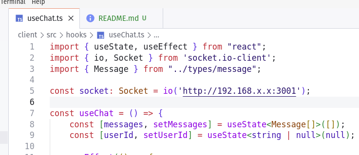

# 📢 Chat Global

Esta é uma aplicação de chat em tempo real, onde diversos usuários podem se conectar simultaneamente e trocar mensagens de forma dinâmica, semelhante a grupos de mensagens populares como o WhatsApp. O foco é permitir uma experiência fluida de comunicação, com a interface diferenciando mensagens enviadas por você e pelos outros usuários conectados.

## 🚀 Funcionalidades

- **Mensagens em tempo real:** As mensagens são enviadas instantaneamente para todos os usuários conectados.
- **Sistema dinâmico de mensagens:** As suas mensagens são alinhadas à direita e as dos outros usuários à esquerda.
- **Conectividade via LAN e Rede Local:** Possibilidade de testar o chat entre dispositivos na mesma rede.
- **Arquitetura modular:** Separação de componentes e lógica de estado para maior manutenção e escalabilidade.
- **Estilo moderno e limpo:** Uso de CSS customizado para uma interface minimalista e agradável.

---

## 🛠️ Tecnologias Utilizadas

- **Front-end:**
  - React + TypeScript
  - Vite
  - Bootstrap

- **Back-end:**
  - Node.js
  - Socket.IO (para comunicação em tempo real)

- **Ferramentas de Desenvolvimento:**
  - Visual Studio Code
  - Git & GitHub

---

## ⚙️ Como Rodar o Projeto Localmente

### Pré-requisitos
- **Node.js** instalado (versão 18+)
- **Git** para clonar o repositório
- **Vite** para rodar o front-end
- **LAN ou Rede Local** (para testes de comunicação entre dispositivos)

### Instalação e Configuração

Siga as etapas abaixo para configurar o projeto na sua máquina local:

```bash
# Clone o repositório

git clone git@github.com:matheusdmlopes/projeto-socket.git
cd projeto-socket

# Instale as dependências no front-end e no back-end

# No cliente (front-end)

cd client
npm install

# No servidor (back-end)

cd server
npm install

# Inicie o servidor (back-end)

cd server
npm run dev

# Inicie o cliente (front-end)

cd client
npm run dev

# Acesse a aplicação no navegador

http://localhost:3000
```

## Teste em Rede Local/LAN

### No arquivo useChat.ts, altere o parâmetro passado pra função io('...') pro IP da sua máquina local.



---

## 📞 Contato

- **Autor:** Matheus De Marco Lopes  
- [GitHub](https://github.com/matheusdmlopes) | [LinkedIn](https://www.linkedin.com/in/matheusdemarcolopes)

---
